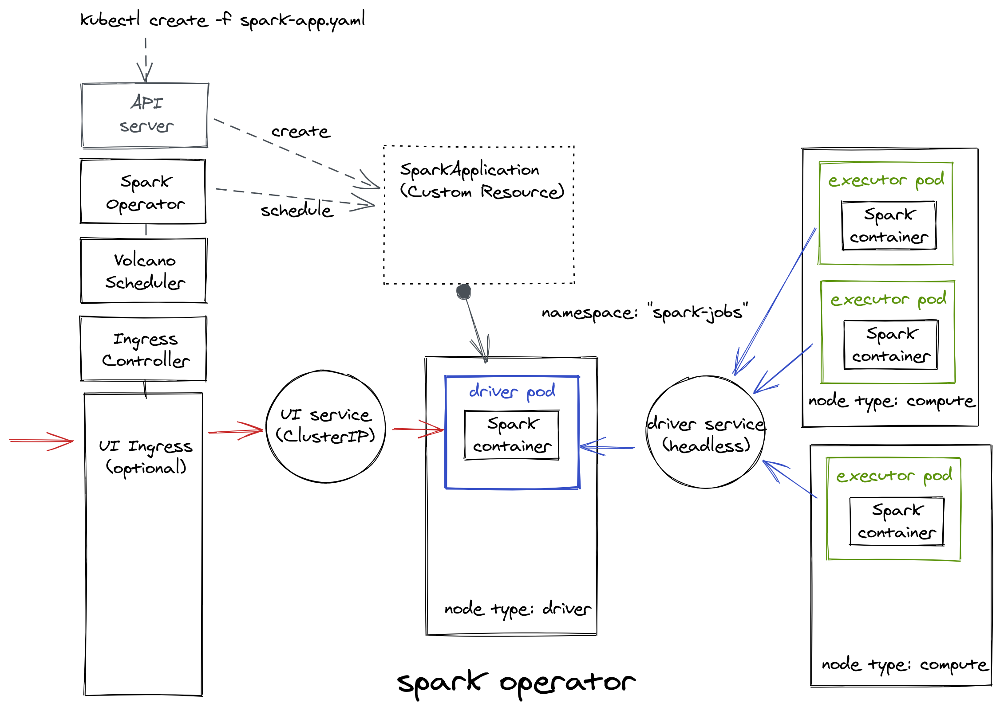

# My Journey With Spark On Kubernetes... In Python

_Je vous parle d'un temps
Que les moins de vingt ans
Ne peuvent pas connaître_ :notes:

Until not long ago, the way to go to run Spark on a cluster was either with Spark's own standalone cluster manager, 
Mesos or YARN. In the meantime, the Kingdom of Kubernetes has risen and spread widely.

And when it comes to run Spark on Kubernetes, you now have two choices:

- Use "native" Spark's Kubernetes capabilities: Spark can run on clusters managed by Kubernetes since Spark 2.3.
  Kubernetes support was still flagged as experimental until very recently, but as per 
  [SPARK-33005 Kubernetes GA Preparation](https://issues.apache.org/jira/browse/SPARK-33005), Spark on Kubernetes is 
  now fully supported and production ready! :confetti_ball:

- Use the Spark Operator, proposed and maintained by Google, which is still in beta version (and always will be).

This series of 3 articles tells the story of my experiments with both methods, and how I launch Spark applications 
from Python code.

_"Cabin crew, arm doors and cross check"_. Let's go! :airplane:

<!--more-->

# Prerequisites

## Service Account for Driver Pods

> Remember, _Spark applications run as independent sets of processes on a cluster, coordinated by the `SparkContext`
object in your main program, called the `driver`. Once connected, the SparkContext acquires `executors` on nodes in the 
cluster, which are the processes that run computations and store data for your application_.

Thus, Spark driver pods need a Kubernetes service account in the pod's namespace that has permissions to create, get, 
list, and delete executor pods. Below an example RBAC setup that creates a driver service account named `yippee-spark` in
 the namespace `spark-jobs`, with a RBAC role binding giving the service account the needed permissions.

`k8s/yippee-spark-rbac.yaml`
```yaml
apiVersion: v1
kind: ServiceAccount
metadata:
  name: yippee-spark
  namespace: spark-jobs
---
apiVersion: rbac.authorization.k8s.io/v1
kind: Role
metadata:
  namespace: spark-jobs
  name: spark-role
rules:
- apiGroups: [""]
  resources: ["pods"]
  verbs: ["*"]
- apiGroups: [""]
  resources: ["services"]
  verbs: ["*"]
---
apiVersion: rbac.authorization.k8s.io/v1
kind: RoleBinding
metadata:
  name: spark-role-binding
  namespace: spark-jobs
subjects:
- kind: ServiceAccount
  name: yippee-spark
  namespace: spark-jobs
roleRef:
  kind: Role
  name: spark-role
  apiGroup: rbac.authorization.k8s.io
```

```bash
kubectl create namespace spark-jobs
kubectl create -f k8s/yippee-spark-rbac.yaml
```

## Node Affinity

By default, the scheduler automatically places pods on nodes by ensuring nodes have sufficient free resources
, distributing pods evenly across nodes, etc.
But there are circumstances where you may want more control on a node where a pod lands, for example to ensure that a
 pod ends up on a memory or compute-optimized machine, or with an SSD attached to it.
In our case, Spark executors need more resources than drivers. We thus need to constrain driver pods and executor
 pods to only be able to run on particular node(s). We will use 
 [Node Affinities](https://kubernetes.io/docs/concepts/scheduling-eviction/assign-pod-node/) with 
 [label selectors](https://kubernetes.io/docs/concepts/overview/working-with-objects/labels/) to make the selection.

Execute the following command for the node(s) intended to execute driver pods:

```bash
kubectl label nodes <node-name> type=driver
```

For executor pods:

```bash
kubectl label nodes <node-name> type=compute
```

## Pod Priority and Preemption

In my project, we aim to run multiple Spark jobs simultaneously in parallel. But some workloads have higher priority
 than others. If a job cannot be scheduled, the scheduler (here, Volcano) tries to preempt (evict) lower priority
  Pods to make scheduling of the pending Pod possible.
To use priority and preemption capabilities, we must first create the necessary `PriorityClasses`:

`k8s/priorities.yaml`
```yaml
---
apiVersion: scheduling.k8s.io/v1
kind: PriorityClass
metadata:
  name: routine
value: 2
preemptionPolicy: Never
globalDefault: false
description: "Routine priority"
---
apiVersion: scheduling.k8s.io/v1
kind: PriorityClass
metadata:
  name: urgent
value: 10
preemptionPolicy: Never
globalDefault: false
description: "Urgent priority"
---
apiVersion: scheduling.k8s.io/v1
kind: PriorityClass
metadata:
  name: exceptional
value: 50
preemptionPolicy: Never
globalDefault: false
description: "Exceptional priority"
---
apiVersion: scheduling.k8s.io/v1
kind: PriorityClass
metadata:
  name: rush
value: 100
preemptionPolicy: PreemptLowerPriority
globalDefault: false
description: "Rush priority"
```

```bash
kubectl create -f k8s/priorities.yaml
```

Here, only the PriorityClass "rush" is allowed to preempt lower-priority pods. Pods with other priorities will be 
placed in the scheduling queue ahead of lower-priority pods, but they cannot preempt other pods. They'll just have 
to wait until sufficient resources are free to be scheduled.

# Volcano Scheduler

For our experiments, we will use [Volcano](https://github.com/volcano-sh/volcano) which is a batch scheduler for 
Kubernetes, well-suited for scheduling Spark applications pods with a better efficiency than the default 
[kube-scheduler](https://kubernetes.io/docs/concepts/scheduling-eviction/kube-scheduler/).
The main reason is that Volcano allows **"group scheduling"** or **"gang scheduling"**: while the default scheduler of 
Kubernetes schedules containers one by one, Volcano ensures that a _gang_ of related containers (here, the Spark driver 
and its executors) can be scheduled at the same time. If for any reason it is not possible to deploy all the 
containers in a gang, Volcano will not schedule that gang. 
This [article](https://www.cncf.io/blog/2021/02/10/three-reasons-why-you-need-volcano/) explains in more detail the 
reasons for using Volcano.

## Install Volcano

Install Volcano on the cluster:

```bash
kubectl apply -f https://raw.githubusercontent.com/volcano-sh/volcano/master/installer/volcano-development.yaml
```

## Enable job preemption

The preempt action is responsible for preemptive scheduling of high priority tasks in the same queue according to 
priority rules.

This action is disabled by default in Volcano.
To enable job preemption, edit the Volcano configuration as follows:

```bash
kubectl edit configmap volcano-scheduler-configmap --namespace volcano-system
```

And add `preempt` to the list of `actions`:

```yaml
# Please edit the object below. Lines beginning with a '#' will be ignored,
# and an empty file will abort the edit. If an error occurs while saving this file will be
# reopened with the relevant failures.
#
apiVersion: v1
data:
  volcano-scheduler.conf: |
    actions: "enqueue, allocate, preempt, backfill"
    tiers:
    - plugins:
      - name: priority
      - name: gang
      - name: conformance
    - plugins:
      - name: drf
      - name: predicates
      - name: proportion
      - name: nodeorder
      - name: binpack
kind: ConfigMap
metadata:
  ...

```

Note that job preemption in Volcano relies on the priority plugin that compares the priorities of two jobs or tasks. For 
two jobs, it decides whose priority is higher by comparing `job.spec.priorityClassName`. For two tasks, it decides whose 
priority is higher by comparing `task.priorityClassName`, `task.createTime`, and `task.id` in order.

## Enable Volcano scheduling in your workload

For your workload to be scheduled by Volcano, you just need to set `schedulerName: volcano` in your pod's `spec` (or
 `batchScheduler: volcano` in the `SparkApplication`'s `spec` if you use the Spark Operator). By default, the
  workload is scheduled with the default `kube-scheduler`.

**To be consistent, we will ensure that the same scheduler is used for driver and executor pods.**

# Spark In Docker

To run Spark applications on Kubernetes ... ehh ... You need a Docker image that embeds a Spark distribution.
This section explains how to build an "official" Spark Docker image and how to run a basic Spark application with it.

## Spark Docker image

Spark (starting with version 2.3) ships with Dockerfiles that can be used to build different Spark Docker images (and 
customize them to match an individual application’s needs) to use with a Kubernetes backend. They can be found in the 
`kubernetes/dockerfiles/` directory.

Spark also ships with a `bin/docker-image-tool.sh` script that eases the building (and the publishing) of the Docker 
images.

Example usage to build an image with the Python binding (PySpark):

```bash
./bin/docker-image-tool.sh -t <tag> -p ./kubernetes/dockerfiles/spark/bindings/python/Dockerfile build
```

This will create a local Docker image named `spark-py:<tag>`. You can set the `<tag>` with the Spark's actual version. 

## Running the Examples

Once the image is bundled, you can launch a Spark application using the `bin/spark-submit` script.

```bash
# Run Spark locally with two worker threads
docker run --rm spark-py:3.0.1 /opt/spark/bin/spark-submit --master local[2] /opt/spark/examples/src/main/python/pi.py
```

## Recommendation

It is strongly recommended starting from an official _base_ image to create any custom Spark image.

# Spark Operator

## Configuring and installing the Kubernetes Operator for Apache Spark

In this section, you use [Helm](https://github.com/kubernetes/helm) to deploy the [Kubernetes Operator for Apache Spark](https://github.com/GoogleCloudPlatform/spark-on-k8s-operator) from the incubator [Chart](https://github.com/helm/charts/tree/master/incubator/sparkoperator) repository. Helm is a package manager you can use to configure and deploy Kubernetes apps.

### Install Helm

1. Downlad and install the `Helm` binary:

```bash
wget https://get.helm.sh/helm-v3.3.4-linux-amd64.tar.gz
```

2. Unzip the file to your local system:

```bash
tar zxfv helm-v2.12.3-linux-amd64.tar.gz
cp linux-amd64/helm .
```

3. Ensure that Helm is properly installed by running the following command:

```bash
./helm version
```

If Helm is correctly installed, you should see the following output:

```bash
version.BuildInfo{Version:"v3.3.4", GitCommit:"a61ce5633af99708171414353ed49547cf05013d", GitTreeState:"clean", GoVersion:"go1.14.9"}
```

### Install the chart

```bash
helm repo add incubator http://storage.googleapis.com/kubernetes-charts-incubator
kubectl create namespace spark-operator
helm install spark-operator incubator/sparkoperator --namespace spark-operator --set enableWebhook=true --set enableBatchScheduler=true
```

The flag`enableBatchScheduler=true` enables Volcano. To install the operator with Vocano enabled, you must also install 
the mutating admission webhook with the flag `enableWebhook=true`.

Now you should see the operator running in the cluster by checking the status of the Helm release:


```bash
./helm status spark-operator --namespace spark-operator
```

### About the Spark Job Namespace and the Service Account for Driver Pods

We did not set a specific value for the Helm chart property `sparkJobNamespace` when installing the operator, that means 
the Spark Operator supports deploying `SparkApplications` to all namespaces.
As a consequence, the Spark Operator did not automatically create the service account for driver pods, and we must set 
up the RBAC for driver pods of our `SparkApplications` to be able to manipulate executor pods in a specific namespace.

See [About the Spark Job Namespace](https://github.com/GoogleCloudPlatform/spark-on-k8s-operator/blob/master/docs/quick-start-guide.md#about-the-spark-job-namespace) and [About the Service Account for Driver Pods](https://github.com/GoogleCloudPlatform/spark-on-k8s-operator/blob/master/docs/quick-start-guide.md#about-the-service-account-for-driver-pods) sections for more details.

## Running the Examples

To run the Spark Pi example provided within the operator, run the following command:

```bash
kubectl apply -f examples/spark-py-pi.yaml
```

# Spark-submit vs Spark Operator

Let's take a closer look at the 
[Pi example](https://github.com/GoogleCloudPlatform/spark-on-k8s-operator/blob/master/examples/spark-py-pi.yaml) 
from the Spark Operator. A single YAML file is needed, adapted to our configuration: `.metadata.namespace` must be 
set to "spark-jobs" and  `.spec.driver.serviceAccount` is set to the name of the service account "yippee-spark" 
previously created.

```yaml
apiVersion: "sparkoperator.k8s.io/v1beta2"
kind: SparkApplication
metadata:
  name: pyspark-pi
  namespace: spark-jobs
spec:
  batchScheduler: volcano
  batchSchedulerOptions:
    priorityClassName: routine
  type: Python
  pythonVersion: "2"
  mode: cluster
  image: "gcr.io/spark-operator/spark-py:v3.0.0"
  imagePullPolicy: Always
  mainApplicationFile: local:///opt/spark/examples/src/main/python/pi.py
  arguments:
  - "10"
  sparkVersion: "3.0.0"
  restartPolicy:
    type: OnFailure
    onFailureRetries: 3
    onFailureRetryInterval: 10
    onSubmissionFailureRetries: 5
    onSubmissionFailureRetryInterval: 20
  timeToLiveSeconds: 86400
  driver:
    affinity:
      nodeAffinity:
        requiredDuringSchedulingIgnoredDuringExecution:
          nodeSelectorTerms:
          - matchExpressions:
            - key: type
              operator: In
              values: [driver]
    cores: 1
    coreLimit: "1200m"
    memory: "512m"
    labels:
      version: 3.0.0
    serviceAccount: yippee-spark
  executor:
    affinity:
      nodeAffinity:
        requiredDuringSchedulingIgnoredDuringExecution:
          nodeSelectorTerms:
          - matchExpressions:
            - key: type
              operator: In
              values: [compute]
    cores: 1
    instances: 2
    memory: "512m"
    labels:
      version: 3.0.0
```

Pretty simple, right!?

The Spark Operator aims to make specifying and running Spark applications in a cloud-native way and as easy and 
idiomatic as running other workloads on Kubernetes. It uses Kubernetes 
[custom resources](https://kubernetes.io/docs/concepts/extend-kubernetes/api-extension/custom-resources/) for 
specifying, running, and monitoring Spark applications.

With the high-level resource `SparkApplication`, the operator greatly reduces the boilerplate YAML configuration 
files and takes care of all the needed plumbing for you: networking between the driver and its executors, garbage 
collection, pod configuration, access to the driver UI.

The following diagram shows what is actually deployed in Kubernetes under the hood:



In use, the operator is way much easier than `spark-submit`. But spark-submit is definitely not going away and is 
still the Spark native way of launching applications. _"In the long term, for application submission, the operator 
will not semantically nor functionally diverge from spark-submit and will always use it under the hood"_. More 
importantly, _"the spark-submit script use all of Spark’s supported cluster managers through a uniform interface so 
you don’t have to configure your application especially for each one"_ (see 
[here](https://github.com/GoogleCloudPlatform/spark-on-k8s-operator/issues/225)). Still, that shouldn't prevent the 
Apache Spark project from developing its own operator in my opinion.

Eventually, choosing between the Spark Operator and spark-submit is a matter of if you are more _Kubernetes_-centric 
and you run Spark workloads among other types of workloads, or you do Spark first, and Kubernetes is just a mean to 
allocate resources on a cluster.

In the following article, we will see how the magic of the Spark operator operates, by reproducing all of its 
internals with spark-submit.
